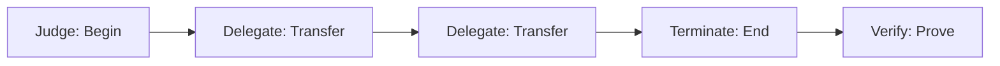

# Design Philosophy: JEP as a Structured Language for Accountability

**Version 1.0 | 2026-03-08**

JEP is not another AI governance tool. It is a **structured language** designed from first principles to enable any AI system, in any jurisdiction, under any regulatory framework, to answer one question: **Who is responsible?**

This document explains the foundational choices that make this possible.

---

## 1. The Four Primitives — The Complete Grammar

Every human language has verbs to express action. JEP has four verbs to express responsibility:

| Primitive | Function | Human Analogy | Legal Analogy |
|-----------|----------|---------------|---------------|
| **`judge`** | Establish initial accountability | "I take responsibility" | Original jurisdiction |
| **`delegate`** | Transfer responsibility to another agent | "I authorize you to act on my behalf" | Agency law, delegation |
| **`terminate`** | Conclude accountability | "My responsibility ends here" | Statute of limitations |
| **`verify`** | Independently attest to the record | "Let me check the signature" | Notarization, audit |

### Why These Four?

These four primitives cover the **complete lifecycle of responsibility**:



- **Judge** creates responsibility
- **Delegate** moves it across systems or agents
- **Terminate** ends it
- **Verify** proves the entire chain

No more, no less. Any accountability scenario — from a simple AI decision to a complex multi-agent workflow — can be expressed using these four verbs.

### Example: Cross-Border Loan Approval

```
judge(DeutscheBankAI, {version: "2.1", authority: "loan-approval"})
    → delegate(AxaAI, {purpose: "credit-check"})
    → delegate(EquifaxAPI, {purpose: "data-retrieval"})
    → terminate(ItalianOfficer, {decision: "deny"})
```

This single chain tells the complete story:
- **Who started it**: Deutsche Bank AI
- **Who it passed through**: Axa AI → Equifax
- **Who ended it**: Italian compliance officer

---

## 2. Cryptographic Trust — The Ink of the Language

A language is useless if its words can be forged. JEP uses two cryptographic primitives to ensure every "sentence" is authentic and tamper-proof.

### 2.1 Ed25519 Signatures — Non-Repudiation

Every judgment event is signed with **Ed25519 (RFC 8032)** — the same algorithm used in modern secure systems like SSH, Tor, and blockchain.

This provides:
- **Authenticity**: You know exactly who issued the judgment
- **Non-repudiation**: The signer cannot deny having issued it
- **Integrity**: Any modification breaks the signature

```python
# Any tampering is immediately detectable
original = {"status": "APPROVED", "receipt_id": "jep_..."}
signature = ed25519.sign(original)

tampered = {"status": "DENIED", "receipt_id": "jep_..."}
assert ed25519.verify(tampered, signature) == False  # Fails immediately
```

### 2.2 UUIDv7 — Temporal Order

Every receipt includes a **UUIDv7 (RFC 9562)**, which encodes both:

```
jep_0195f6d8-1234-7123-8abc-9def01234567
           └─┬──┘
         version 7 = timestamp-based
```

- **Uniqueness**: No two receipts are the same
- **Temporal order**: The timestamp is built into the ID

This enables:
- **Millisecond-level sorting** without separate indexes
- **Billion-scale audit retrieval** in real time
- **No central clock synchronization needed**

### 2.3 Future-Proof by Design

Critically, JEP's cryptographic design is **algorithm-agnostic**:

```json
{
  "receipt_id": "jep_0195f6d8-1234-7123-8abc-9def01234567",
  "alg": "Ed25519",        // Algorithm explicitly identified
  "signature": "0x7a8b9c...",
  "payload": {...}
}
```

The `alg` field allows the protocol to evolve with technology:

| Era | Algorithm | JEP Support |
|-----|-----------|--------------|
| Today | Ed25519 | ✅ Native |
| Near future | Post-quantum candidates | ✅ Via `alg` field |
| Any future | New national standards | ✅ Algorithm identifier ready |

**The same principle applies to hash algorithms and protocol versions.** JEP is designed to evolve with technology, not be locked into today's choices.

---

## 3. Privacy by Design — Accountability Without Exposure

A language that exposes private information is unusable in the real world. JEP is designed from first principles to enable **full accountability without violating privacy**.

### 3.1 Minimal Information Principle — Only What's Necessary

Every JEP receipt contains only the fields required to prove responsibility:

| Field | Contains | Does NOT Contain |
|-------|----------|------------------|
| **Identity** | Agent ID, responsible party ID | Real names, personal identifiers |
| **Authority** | Delegation chain (who authorized whom) | Context of conversations, personal history |
| **Decision fact** | Decision type, timestamp, receipt hash | Input data, user preferences, model internals |
| **Signature** | Cryptographic proof | Private keys, sensitive credentials |

This aligns with GDPR's "data minimization" principle — processing only the personal data necessary for the specific purpose.

### 3.2 Zero-Knowledge Verification — Prove Without Revealing

The `verify` primitive enables independent attestation **without exposing sensitive data**:

```python
# A regulator can verify the integrity of the entire chain
is_valid = jep.verify_chain(receipt_chain)

# Without ever accessing:
# - The specific loan applicant's income
# - The medical patient's diagnosis details
# - The proprietary model parameters
# - The user's personal conversation history
```

This is conceptually similar to Merkle proofs in blockchain — you can prove a transaction exists without revealing every transaction in the chain.

### 3.3 Selective Disclosure — Payload Can Be Encrypted

Receipts support encrypted payload fields:

```json
{
  "receipt_id": "jep_0195f6d8-1234-7123-8abc-9def01234567",
  "event_type": "judge",
  "judge_id": "HospitalAI",
  "timestamp": "2026-03-08T09:30:00Z",
  "signature": "0x7a8b9c...",
  "payload_encrypted": "0x4e5f6a...",  // Only decryptable by authorized parties
  "payload_metadata": {                  // Always visible metadata
    "contains_pii": true,
    "decryptor_ids": ["regulator@msit.kr", "auditor@hospital.kr"]
  }
}
```

This enables:
- **Default privacy**: Sensitive factors are encrypted by default
- **Audit access**: Regulators receive decryption keys
- **User control**: Individuals can see data about themselves

### 3.4 No Central Database — Distributed by Design

JEP does not require a central repository of all receipts:

- Receipts can be stored by the responsible party
- Verification only requires checking the signature chain
- No single point of data leakage
- Compliant with data localization requirements

This design respects **data sovereignty** — receipts can stay within jurisdictional boundaries while still being verifiable globally.

### 3.5 Alignment with Global Privacy Frameworks

| Requirement | GDPR | CCPA | JEP Implementation |
|-------------|------|------|---------------------|
| **Data minimization** | Art. 5(1)(c) | Cal. Civ. Code §1798.100 | Receipts contain only responsibility fields |
| **Purpose limitation** | Art. 5(1)(b) | §1798.100 | Receipts used only for accountability |
| **Storage limitation** | Art. 5(1)(e) | — | No mandatory central storage |
| **Integrity & confidentiality** | Art. 5(1)(f) | §1798.81.5 | Signatures + optional encryption |
| **Transparency** | Art. 5(1)(a) | §1798.110 | Public receipt format, open verification |
| **Individual rights** | Art. 15-22 | §1798.130 | Users can verify receipts about themselves |

【新增结束】

---

## 4. Structured for Maximum Compatibility

Because JEP is a **language** (not a platform), it achieves maximum compatibility through structured design.

### 4.1 Model-Agnostic

JEP operates as a **transparent proxy** between AI applications and their users. It requires **zero modification** to any AI model:

| Model | Support | Modification Required |
|-------|---------|----------------------|
| GPT-4 / GPT-5 | ✅ | None |
| Llama 3 / Llama 4 | ✅ | None |
| Claude | ✅ | None |
| Mistral | ✅ | None |
| Custom models | ✅ | None |

### 4.2 Jurisdiction-Agnostic

JEP's **sidecar architecture** can be deployed anywhere:

```
┌─────────────────┐     ┌─────────────────┐     ┌─────────────────┐
│   AI Model      │     │   JEP Sidecar   │     │   Audit Layer   │
│  (any cloud)    │ ←→ │ (local/sovereign)│ ←→ │  (public hashes)│
└─────────────────┘     └─────────────────┘     └─────────────────┘
```

- ✅ On-premises
- ✅ Sovereign cloud
- ✅ Hybrid
- ✅ Air-gapped environments

### 4.3 Framework-Agnostic

The same structured output maps to any regulatory framework:

| Framework | JEP Implementation |
|-----------|-------------------|
| **Singapore Agentic Framework** | [`jep-singapore-solutions`](https://github.com/hjs-spec/jep-singapore-solutions) |
| **ASEAN Agentic Framework** | [`jep-asean-solutions`](https://github.com/hjs-spec/jep-asean-solutions) |
| **Korea AI Basic Act** | [`jep-kr-solutions`](https://github.com/hjs-spec/jep-kr-solutions) |

**Proof**: The same protocol serves three completely different frameworks without modification.

---

## 5. Governed for Neutrality

A language cannot be owned by any single company. JEP is governed by:

### HJS Foundation LTD (Singapore) — Non-profit CLG

| Governance Feature | Implementation |
|-------------------|----------------|
| **Legal Form** | Company Limited by Guarantee (non-profit) |
| **Shareholders** | ❌ None |
| **Profit Distribution** | ❌ Prohibited by constitution |
| **Asset Lock** | ✅ Core IP cannot be sold or transferred |
| **Independent Directors** | ✅ 1/3 from academic/policy/industry |

### Multi-Stakeholder Representation

The foundation's governance includes voices from:

- **Technical experts** — Ensure protocol integrity
- **Privacy advocates** — Protect individual rights
- **Legal scholars** — Maintain regulatory alignment
- **Industry representatives** — Ensure practical utility

See full details: [`GOVERNANCE_CHARTER.md`](GOVERNANCE_CHARTER.md)

---

## 6. Summary: The Complete Picture

| Design Choice | What It Enables |
|---------------|-----------------|
| **Four primitives** | Complete grammar for any accountability scenario |
| **Ed25519 signatures** | Non-repudiation, tamper-proof evidence |
| **UUIDv7** | Temporal ordering, billion-scale audit |
| **Algorithm-agnostic** | Future-proof, quantum-resistant |
| **【新增】 Minimal information** | Collect only necessary responsibility fields |
| **【新增】 Zero-knowledge verification** | Prove without exposing sensitive data |
| **【新增】 Selective disclosure** | Encrypt payload, control access |
| **【新增】 No central database** | Distributed, data sovereignty respected |
| **Model-agnostic** | Zero modification to existing AI |
| **Jurisdiction-agnostic** | Deploy anywhere, sovereignty respected |
| **Framework-agnostic** | One language, multiple regulations |
| **Non-profit governance** | Neutral, public-interest steward |

---

## 7. References

- [JEP IETF Draft](https://datatracker.ietf.org/doc/draft-wang-hjs-judgment-event/)
- [RFC 8032: Ed25519](https://datatracker.ietf.org/doc/html/rfc8032)
- [RFC 9562: UUIDv7](https://datatracker.ietf.org/doc/html/rfc9562)
- [JSON-LD W3C Standard](https://www.w3.org/TR/json-ld11/)
- 【新增】[GDPR Article 5: Principles relating to processing of personal data](https://gdpr-info.eu/art-5-gdpr/)
- 【新增】[CCPA: California Consumer Privacy Act](https://oag.ca.gov/privacy/ccpa)

---

**Document History**
- 2026-03-08: Initial version
- 2026-03-08: Added Privacy by Design section

*This design philosophy is implemented in all JEP code and documentation. Every design choice is reflected in the protocol.*
```
