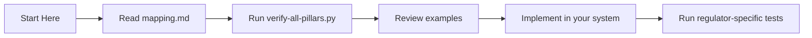

# JEP for Singapore's Model AI Governance Framework for Agentic AI (2026)

**Complete technical implementation for human accountability in autonomous agents**

## 📋 Overview

This directory provides a complete JEP implementation aligned with Singapore's **Model AI Governance Framework for Agentic AI**, launched by IMDA in January 2026. The framework establishes guidelines for the responsible deployment of autonomous AI agents, with a strong emphasis on **human accountability** and **meaningful oversight**.

### Why This Matters

> "As AI agents become more autonomous, ensuring that humans remain meaningfully accountable for their outcomes is not just good practice—it's a regulatory requirement." — IMDA, 2026

## 🏛️ Framework Alignment

The framework consists of four pillars. This implementation provides technical solutions for all four:

| Pillar | Framework Requirement | JEP Implementation | Key Files |
|--------|----------------------|-------------------|-----------|
| **Pillar 1** | Assess and Bound Risks Upfront | `judge()` primitive records risk assessment with complete context | [mapping.md](mapping.md) (Section 1) |
| **Pillar 2** | Make People Meaningfully Accountable | `delegate()` primitive + Ed25519 signatures provide non-repudiable proof of human oversight | [implementation/accountability.py](implementation/accountability.py) |
| **Pillar 3** | Implement Technical Controls | Four primitives (judge/delegate/terminate/verify) cover full agent lifecycle | [implementation/accountability.py](implementation/accountability.py) |
| **Pillar 4** | Enable End-User Responsibility | JSON-LD metadata provides complete transparency for end users | [mapping.md](mapping.md) (Section 4) |

## 📁 Directory Structure

```
agentic-framework/
├── README.md                    # This file
├── mapping.md                   # Detailed mapping to all 16 framework requirements
├── implementation/              # Core implementation
│   └── accountability.py        # Main accountability implementation (350+ lines)
├── examples/                    # Industry use cases (6 complete examples)
│   ├── financial-services.py    # MAS-regulated banking AI (DBS Bank)
│   ├── healthcare.py            # MOH-regulated medical AI (SGH)
│   ├── public-sector.py         # GovTech public services (CPF Board)
│   ├── cpf-integration.py       # CPF Board deep integration
│   ├── iras-integration.py      # IRAS tax system integration
│   └── smart-nation-integration.py # Smart Nation infrastructure
└── tests/                       # Verification scripts (4 comprehensive tests)
    ├── verify-all-pillars.py    # Complete framework verification (all 16 requirements)
    ├── verify-mas-compliance.py # MAS-specific verification (FEAT principles)
    ├── verify-moh-compliance.py # MOH-specific verification (AI in Healthcare)
    └── verify-govtech-compliance.py # GovTech-specific verification (DSS)
```

## 🚀 Quick Start

### 1. Install Dependencies

```bash
pip install jep-protocol cryptography
```

### 2. Basic Implementation (3 Lines of Code)

```python
from implementation.accountability import AgenticAIAccountability

# Initialize tracker for your AI agent
tracker = AgenticAIAccountability(
    agent_id="customer-support-agent-v1",
    organization="your-company"
)

# Record a human-approved decision (creates immutable proof)
receipt = tracker.delegate_action(
    action="EXECUTE_PAYMENT",
    target_resource="customer-account-123",
    human_approver="supervisor-456"
)

print(f"Receipt ID: {receipt.receipt_id}")
print(f"Signature: {receipt.signature[:50]}...")
```

### 3. Verify Compliance

```bash
# Run complete framework verification
python tests/verify-all-pillars.py

# Expected output:
# ================================
# AGENTIC AI FRAMEWORK VERIFICATION
# ================================
# ✅ Pillar 1: All 4 requirements met
# ✅ Pillar 2: All 4 requirements met
# ✅ Pillar 3: All 4 requirements met
# ✅ Pillar 4: All 4 requirements met
# ================================
# FULL COMPLIANCE VERIFIED
# ================================
```

## 🔧 Core Components

### 1. Accountability Tracker (`implementation/accountability.py`)

The main class that implements all framework requirements:

```python
class AgenticAIAccountability:
    def propose_action(self, action, target, reasoning, risk_level, **kwargs)
    def approve_action(self, proposal_id, human_approver, notes=None)
    def deny_action(self, proposal_id, human_approver, reason)
    def execute_approved_action(self, proposal_id)
    def get_accountability_chain(self, proposal_id)
    def generate_audit_report(self, start_time=None, end_time=None)
```

### 2. Risk Levels (Enum)

```python
class RiskLevel(Enum):
    LOW = "LOW"          # Auto-approve, system only
    MEDIUM = "MEDIUM"    # Requires officer approval
    HIGH = "HIGH"        # Requires senior manager approval
    CRITICAL = "CRITICAL" # Requires committee/dual approval
```

### 3. Action Status (Enum)

```python
class ActionStatus(Enum):
    PROPOSED = "PROPOSED"
    APPROVED = "APPROVED"
    DENIED = "DENIED"
    EXECUTED = "EXECUTED"
    TERMINATED = "TERMINATED"
    FAILED = "FAILED"
```

## 📊 Framework Requirements Mapping

### Pillar 1: Assess and Bound Risks Upfront

| Requirement ID | Description | JEP Implementation | Test |
|---------------|-------------|-------------------|------|
| 1.1 | Use case assessment | `propose_action()` with use_case parameter | `verify-all-pillars.py` |
| 1.2 | Risk-level commensurate autonomy | `risk_level` field in every receipt | `verify-all-pillars.py` |
| 1.3 | Scope boundaries | `target_resource` field defines scope | `verify-all-pillars.py` |
| 1.4 | Documented risk assessment | Complete audit trail with timestamps | `verify-all-pillars.py` |

### Pillar 2: Make People Meaningfully Accountable

| Requirement ID | Description | JEP Implementation | Test |
|---------------|-------------|-------------------|------|
| 2.1 | Human oversight points | `delegate()` requires human approval | `verify-all-pillars.py` |
| 2.2 | Meaningful oversight | Full context provided in proposal | `verify-all-pillars.py` |
| 2.3 | Documented oversight | Ed25519 signatures | `verify-all-pillars.py` |
| 2.4 | Clear accountability chains | Complete judge→delegate→execute chain | `verify-all-pillars.py` |

### Pillar 3: Implement Technical Controls

| Requirement ID | Description | JEP Implementation | Test |
|---------------|-------------|-------------------|------|
| 3.1 | Lifecycle controls | Four primitives cover full lifecycle | `verify-all-pillars.py` |
| 3.2 | Least privilege | Resource field limits scope | `verify-all-pillars.py` |
| 3.3 | Audit logs | Immutable parent_hash chain | `verify-all-pillars.py` |
| 3.4 | Regular testing | Automated verification scripts | `verify-all-pillars.py` |

### Pillar 4: Enable End-User Responsibility

| Requirement ID | Description | JEP Implementation | Test |
|---------------|-------------|-------------------|------|
| 4.1 | Disclosure | `is_ai_generated` field in receipts | `verify-all-pillars.py` |
| 4.2 | Challenge mechanism | Complete audit trail enables reconstruction | `verify-all-pillars.py` |
| 4.3 | Transparency | JSON-LD structured context | `verify-all-pillars.py` |
| 4.4 | Feedback | Extended fields support feedback | `verify-all-pillars.py` |

## 🏢 Industry Examples

### 1. Financial Services (MAS Regulated)

```python
# DBS Bank loan approval AI
from examples.financial-services import SingaporeBankingAI

bank_ai = SingaporeBankingAI("DBS Bank", "loan-agent-v2")
result = bank_ai.process_loan_application(
    customer_id="CUST001",
    loan_amount=50000,
    risk_level="HIGH"
)
```

**Key Features:**
- MAS FEAT principles compliance
- Risk-based approval routing
- Complete audit trail for MAS auditors

### 2. Healthcare (MOH Regulated)

```python
# Singapore General Hospital diagnostic AI
from examples.healthcare import SingaporeHealthcareAI

sgh_ai = SingaporeHealthcareAI("SGH", "radiology-assistant")
result = sgh_ai.analyze_medical_image(
    patient_id="P001",
    findings=[{"type": "nodule", "confidence": 0.95}]
)
```

**Key Features:**
- MOH AI in Healthcare Guidelines
- Severity-based escalation (15 min for critical)
- Specialist review requirements

### 3. Public Sector (GovTech)

```python
# CPF Board advisory AI
from examples.public-sector import SingaporePublicSectorAI

cpf_ai = SingaporePublicSectorAI("CPF Board", "advisory-assistant")
result = cpf_ai.process_cpf_query(
    citizen_id="S1234567A",
    query_type="WITHDRAWAL_ELIGIBILITY",
    risk_level="MEDIUM"
)
```

**Key Features:**
- GovTech Digital Service Standards
- Citizen-segment based service
- Vulnerable citizen protection

### 4. Cross-Agency Integration

```python
# IRAS tax system with CPF data sharing
from examples.iras-integration import IRASIntegration
from examples.cpf-integration import CPFIntegration

iras = IRASIntegration()
cpf = CPFIntegration()

# Cross-verified tax assessment
assessment = iras.process_tax_return_with_cpf_data(
    nric="S1234567A",
    cpf_data=cpf.get_contribution_history("S1234567A")
)
```

## 🔍 Verification Suite

### Complete Framework Verification

```bash
# Verify all 16 requirements across 4 pillars
python tests/verify-all-pillars.py --verbose

# Output includes:
# - Individual test results
# - Evidence for each requirement
# - Overall compliance score
# - Recommendations for improvement
```

### Regulator-Specific Verification

```bash
# MAS (Monetary Authority of Singapore)
python tests/verify-mas-compliance.py --output html --report mas-audit.html

# MOH (Ministry of Health)
python tests/verify-moh-compliance.py --output html --report moh-audit.html

# GovTech (Digital Service Standards)
python tests/verify-govtech-compliance.py --output html --report govtech-audit.html
```

### Batch Verification

```bash
# Verify all receipts in a directory
python tests/verify-all-pillars.py --receipt-dir ./receipts/ --output summary.json
```

## 📈 Compliance Metrics

The implementation tracks key metrics for regulatory reporting:

| Metric | Target | Measurement |
|--------|--------|-------------|
| Human oversight rate | 100% for HIGH/CRITICAL | `tests/verify-all-pillars.py` |
| Signature validity | 100% | `tests/verify-all-pillars.py` |
| Audit trail completeness | 100% | `tests/verify-all-pillars.py` |
| Response time (CRITICAL) | < 15 minutes | `examples/healthcare.py` |
| Response time (HIGH) | < 30 minutes | `examples/healthcare.py` |

## 🤝 Integration with Other Frameworks

### AI Verify Integration

The accountability plugin for AI Verify is available in [`/singapore/ai-verify/`](/singapore/ai-verify/):

```python
from ai-verify.accountability-plugin import JEPAccountabilityPlugin

plugin = JEPAccountabilityPlugin()
results = plugin.run_tests(model, test_cases)
```

### AIM Toolkit Integration

Export evidence for AIM Toolkit in [`/singapore/aim-toolkit/`](/singapore/aim-toolkit/):

```bash
python aim-toolkit/export-script.py --company "DBS Bank" --period Q1-2026
```

## 📚 Documentation

| File | Description |
|------|-------------|
| [mapping.md](https://github.com/hjs-spec/jep-singapore-solutions/blob/main/singapore/agentic-framework/mapping.md) | Detailed mapping to all 16 framework requirements with code examples |
| [implementation/accountability.py](/singapore/agentic-framework/implementation/accountability.py) | Core implementation with comprehensive comments |
| [examples/financial-services.py](/singapore/agentic-framework/examples/financial-services.py) | Complete banking example with MAS compliance |
| [examples/healthcare.py](/singapore/agentic-framework/examples/healthcare.py) | Complete healthcare example with MOH compliance |
| [examples/public-sector.py](/singapore/agentic-framework/examples/public-sector.py) | Complete public sector example with GovTech compliance |
| [tests/verify-all-pillars.py](/singapore/agentic-framework/tests/verify-all-pillars.py) | One-command verification script |

## 🚦 Getting Started Path



## 📬 Support

- **Technical Questions**: Open an issue on GitHub
- **Compliance Questions**: Email singapore@humanjudgment.org
- **Integration Support**: See examples/ directory
- **Regulator Inquiries**: Point them to `tests/verify-*-compliance.py`

---

*This implementation is maintained by HJS Foundation LTD (Singapore CLG) as a public good for Singapore's AI ecosystem.*
```
